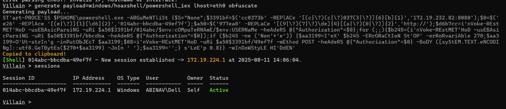
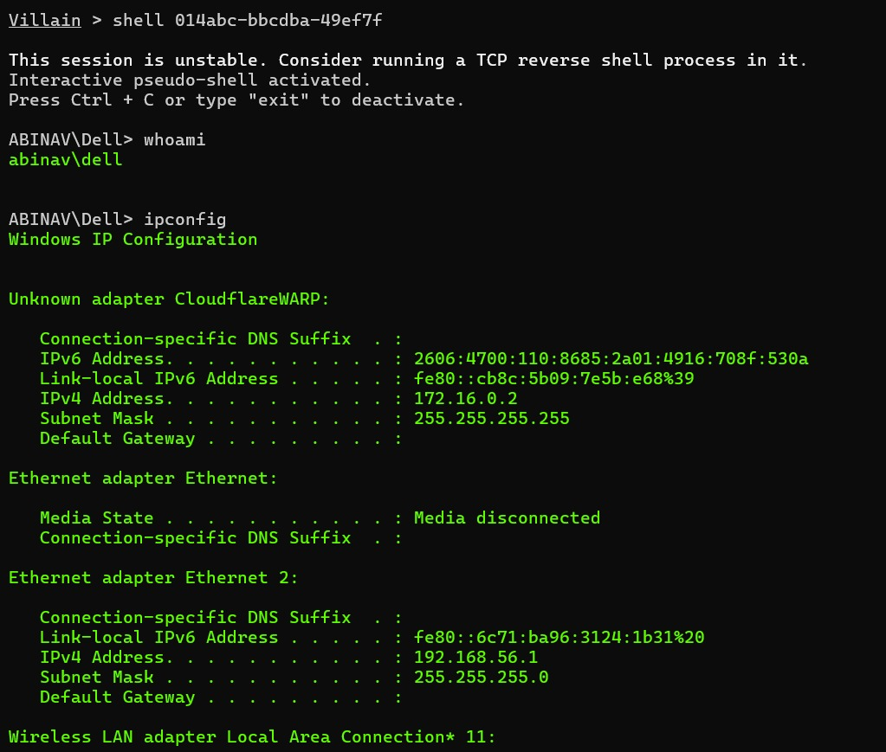
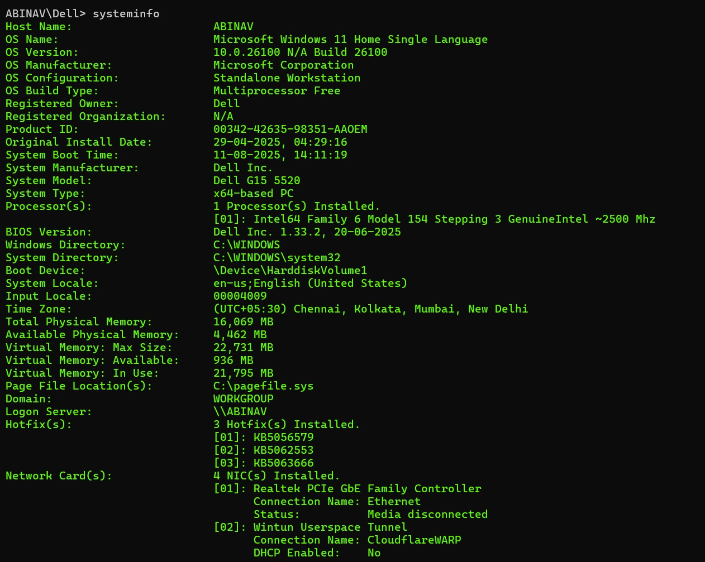
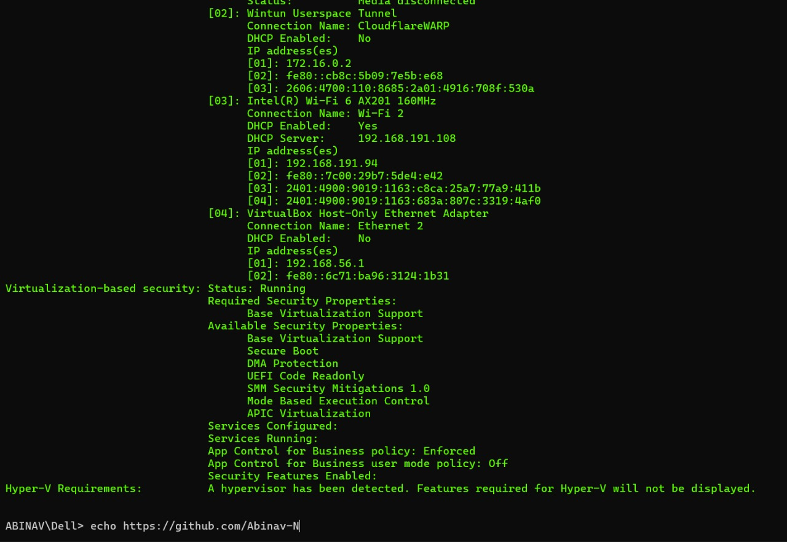

# Villain Framework Reverse Shell Report

## ⚙️ Setup Info
- Payload: `windows/hoaxshell/powershell_iex`
- LHOST: `192.168.56.1`
- LPORT: `eth0`

## 🔁 Payload Delivery Method
- Executed via obfuscated PowerShell command copied from Villain Framework. Delivered to target VM through a local network interface (`eth0`). Payload was executed with user-level privileges.

## 🖥️ Captured Info
- Hostname: `ABINAV`
- IP Address: 
  - `172.16.0.2` (CloudflareWARP)
  - `192.168.191.94` (Wi-Fi)
  - `192.168.56.1` (VirtualBox Host-Only Adapter)
  - `172.19.224.1` (vEthernet WSL)
- User: `abinav/dell`

## 🔎 Enumeration Performed

