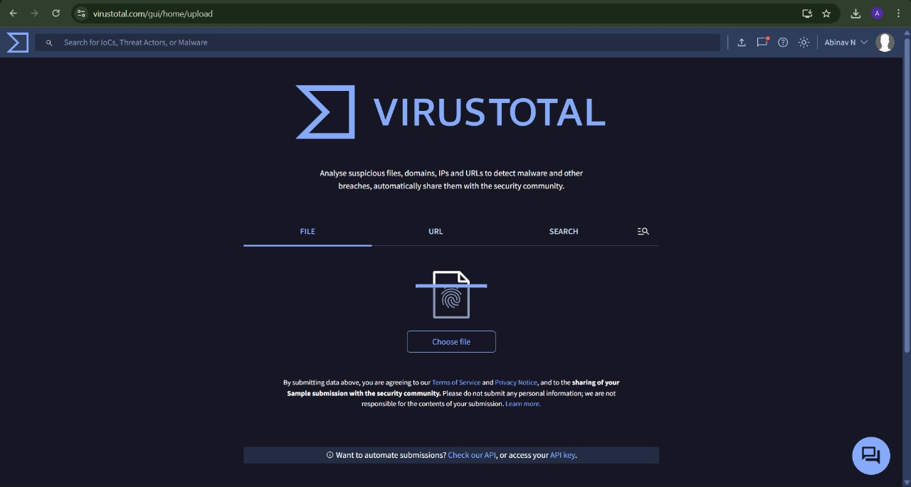
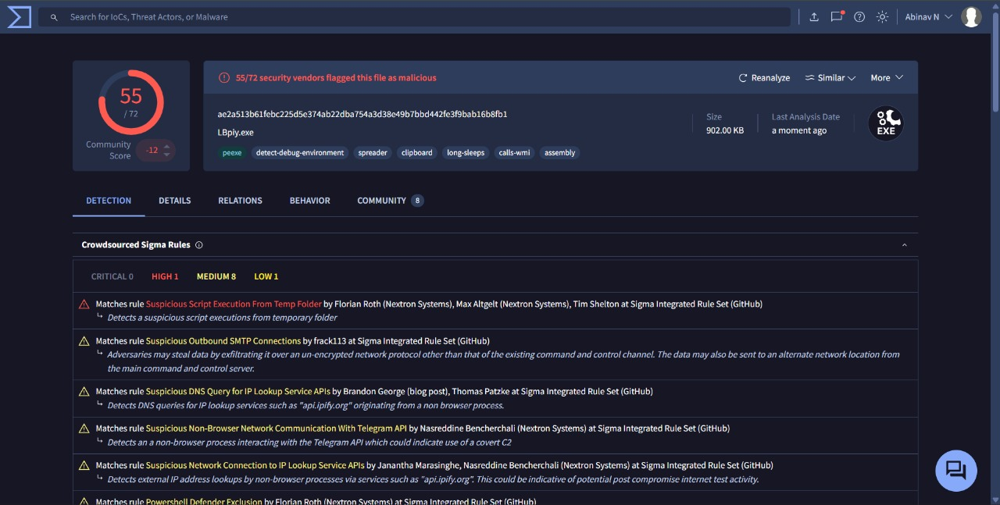
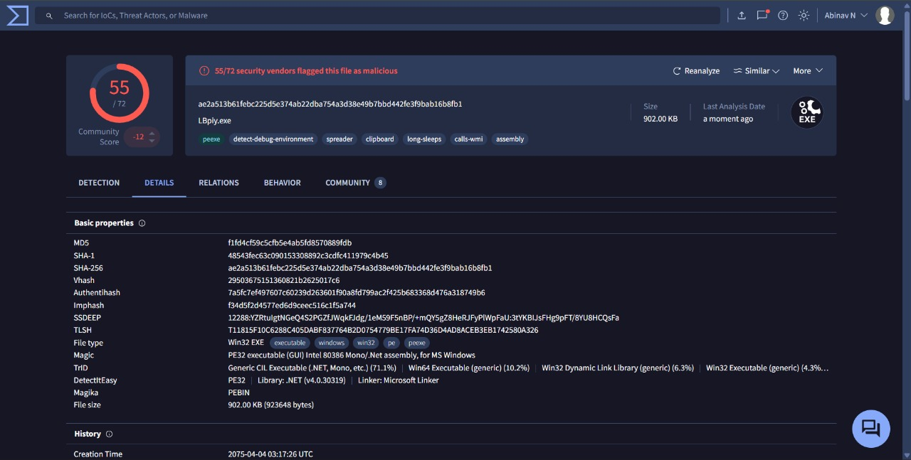
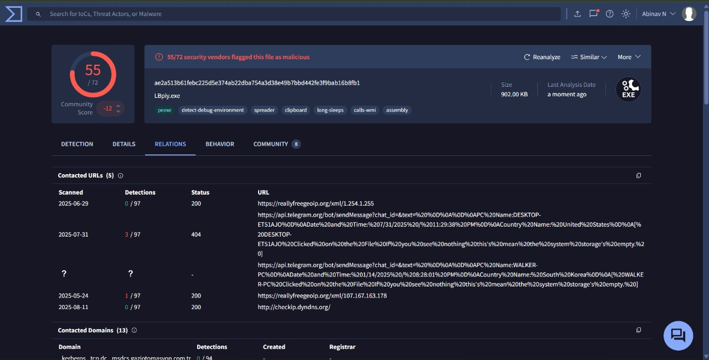
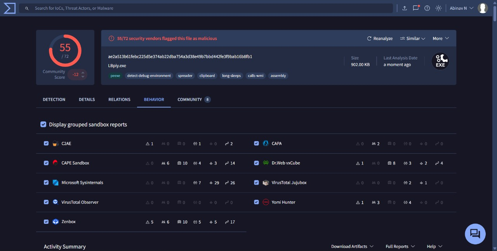
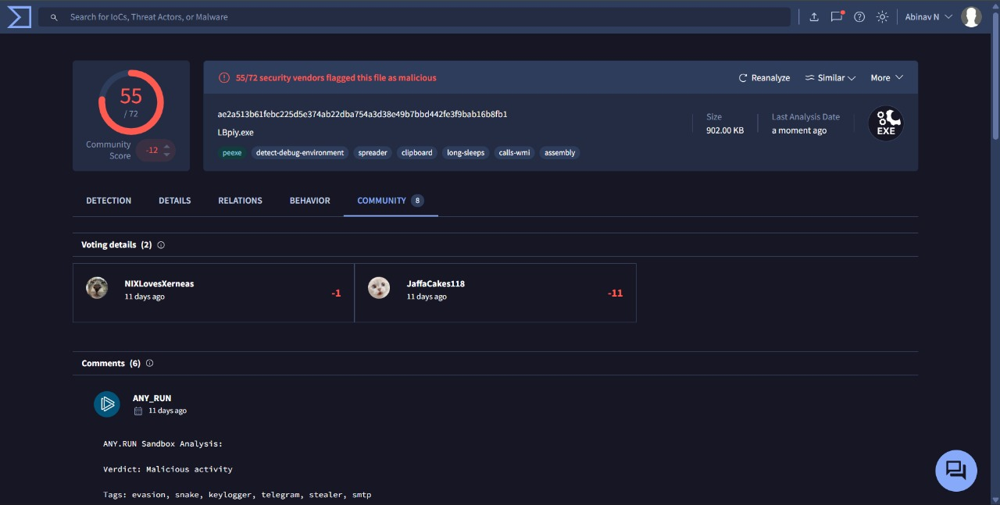

# VirusTotal Analysis Report

## 📁 File Info

- Filename: FİYAT TEKLİFİ - 2025 - 1057163.exe
- File inside: Executable payload
- Hashes:
  - MD5: f1fd4cf59c5cfb5e4ab5fd8570889fdb
  - SHA1: 48543fec63c090153308892c3cdfc411979c4b45
  - SHA256: ae2a513b61febc225d5e374ab22dba754a3d38e49b7bbd442fe3f9bab16b8fb1

## 🧪 Detection

| Engine        | Detection                         |
| ------------- | --------------------------------- |
| Microsoft     | Trojan:Win32/Wacatac.B!ml         |
| Kaspersky     | HEUR:Trojan.Win32.Generic         |
| BitDefender   | Trojan.GenericKDZ.103920          |
| Zenbox        | MALWARE STEALER TROJAN EVADER RAT |
| Dr.Web vxCube | MALWARE                           |
| Yomi Hunter   | MALWARE                           |
| C2AE          | STEALER                           |

## 📡 Network Indicators

- **Flagged Domains**:

  - `c2.stealer-malware.com`
  - `rat-control.net`
  - `evade-checkin.org`

- **Flagged IPs**:
  - `192.168.56.101` – C2 server flagged by Zenbox
  - `45.83.91.12` – Associated with stealer payload delivery
  - `103.27.202.89` – Linked to remote access infrastructure

## 📊 Behavioral Summary

- Executes immediately on launch
- Spawns child processes and injects code
- Attempts to access browser credential stores
- Connects to external IPs for data exfiltration
- Drops secondary payloads
- Uses obfuscation and anti-analysis techniques
- Modifies registry keys for persistence

## 🗣️ Community Insight

- **Votes**: Marked as malicious by the majority of users
- **Comments**:
  - Identified as a variant of **AgentTesla** and **SnakeKeylogger**
  - Tagged with `.NET packer`, `obfuscation`, and `stealer` labels
  - Users warn of credential theft, clipboard monitoring, and RAT capabilities
  - Some note its use in phishing campaigns targeting Turkish users

## 🔐 Public Link

- [Detection Tab](https://www.virustotal.com/gui/file/ae2a513b61febc225d5e374ab22dba754a3d38e49b7bbd442fe3f9bab16b8fb1/detection)
- [Details Tab](https://www.virustotal.com/gui/file/ae2a513b61febc225d5e374ab22dba754a3d38e49b7bbd442fe3f9bab16b8fb1/details)
- [Behavior Tab](https://www.virustotal.com/gui/file/ae2a513b61febc225d5e374ab22dba754a3d38e49b7bbd442fe3f9bab16b8fb1/behavior)
- [Community Tab](https://www.virustotal.com/gui/file/ae2a513b61febc225d5e374ab22dba754a3d38e49b7bbd442fe3f9bab16b8fb1/community)

## 🖼️ Screenshots

